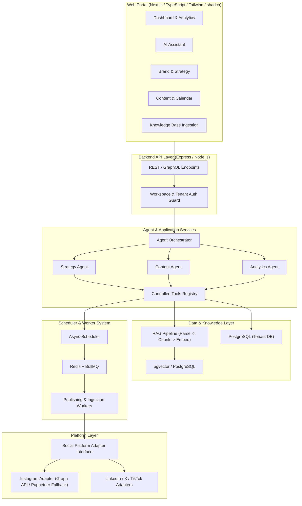

# AI Social Media Agent — Architecture Documentation

## 1. Current Architecture (Foundation Audit)

The current foundation repository (`harshmriduhash/Social-Media-AI-Agent` / `riona-ai-agent`) is a monolithic Node.js / TypeScript CLI & background automation application.

```mermaid
flowchart TD
    App[src/app.ts] --> Client[src/client/Instagram.ts (Missing in repo)]
    App --> DB[src/config/db.ts (Missing in repo)]
    App --> Logger[src/config/logger.ts (Missing in repo)]

    Agent[src/Agent/index.ts] --> GeminiSDK["@google/generative-ai (Gemini 1.5 Flash)"]
    Agent --> Schema[src/Agent/schema/index.ts]

    Training[src/Agent/training/] --> FilesTraining[FilesTraining.ts (pdf, docx, doc, csv, txt)]
    Training --> AudioTraining[TrainWithAudio.ts (GoogleAIFileManager)]
    Training --> WebScraping[WebsiteScraping.ts (Puppeteer + DOMPurify)]
    Training --> YouTubeTraining[youtubeURL.ts (youtube-transcript)]

    YouTubeTraining --> Summarize[src/Agent/script/summarize.ts]
    Summarize --> GeminiSDK
```

### Key Characteristics of Current Architecture
1. **Direct Coupling**: Entrypoints attempt to execute agents directly via process scripts.
2. **Missing Dependencies**: Upstream repository omits `src/client/Instagram.ts`, `src/config/db.ts`, `src/config/logger.ts`, and `src/utils/index.ts`.
3. **Training & Ingestion**: Implements raw content extraction (PDF, DOCX, CSV, Audio, Web, YouTube) but lacks chunking, embedding, vector storage, and RAG retrieval.
4. **AI Generation**: Uses Google Generative AI (`gemini-1.5-flash`) with structured JSON schema responses and circular API key rotation logic in `summarize.ts`.
5. **Database**: References MongoDB / Mongoose (`mongoose` package, `Tweet` model draft in `src/Agent/schema/index.ts`).

---

## 2. Target Architecture (Modular Production SaaS)

The target architecture evolves the foundation into a multi-tenant, modular, event-driven web application with clean separation of concerns.



---

## 3. Architecture Layers & Principles

### Layer 1: Web Portal (`apps/web`)
- **Technology**: Next.js (App Router), TypeScript, Tailwind CSS, shadcn/ui.
- **Responsibilities**: User Interface, Workspace selection, Brand setup, Knowledge document upload, AI Assistant chat, Content draft review/approval, Interactive Calendar.
- **Rule**: Pure UI layer. Consumes Backend REST APIs. Zero direct database or browser automation access.

### Layer 2: API & Authorization (`services/api`)
- **Technology**: Node.js, Express / Fastify, TypeScript.
- **Responsibilities**: Workspace multi-tenancy enforcement, Request validation, Authentication, Routing requests to Core Application Services.

### Layer 3: Agent Orchestrator & AI Core (`packages/ai`, `services/agent`)
- **Technology**: TypeScript, `@google/generative-ai`, Multi-provider wrapper (OpenAI/Gemini/Anthropic).
- **Responsibilities**:
  - **Orchestrator**: Routes user intent to specialized agents.
  - **Strategy Agent**: Formulates content pillars and topics.
  - **Content Agent**: Generates structured hooks, captions, CTAs, and hashtags.
  - **Analytics Agent**: Analyzes performance metrics to produce insights.
- **Controlled Tools**:
  - `get_brand()`
  - `search_knowledge()`
  - `get_recent_content()`
  - `get_analytics()`
  - `create_content()`
  - `update_content()`
  - `schedule_content()`
  - `publish_content()`

### Layer 4: Knowledge Ingestion & RAG (`packages/knowledge`)
- **Pipeline**: Ingest (PDF/DOCX/Audio/Web/YouTube) $\rightarrow$ Text Extraction $\rightarrow$ Recursive Chunking $\rightarrow$ Text Embeddings $\rightarrow$ Vector Storage (`pgvector`) $\rightarrow$ Semantic Retrieval.
- **Workspace Isolation**: Vector embeddings filtered by `workspace_id`.

### Layer 5: Database & Multi-Tenancy (`packages/database`)
- **Target**: PostgreSQL with `pgvector` extension.
- **Core Entities**: `users`, `workspaces`, `brands`, `social_accounts`, `knowledge_documents`, `knowledge_chunks`, `content`, `content_variants`, `content_calendar`, `scheduled_posts`, `publications`, `analytics`, `agent_executions`, `agent_memory`, `conversations`.
- **Constraint**: All tenant resources must enforce `workspace_id` scoping.

### Layer 6: Asynchronous Scheduler & Worker (`packages/scheduler`, `services/worker`)
- **Technology**: Redis + BullMQ.
- **Responsibilities**: Off-loads publishing jobs, knowledge ingestion tasks, and long-running AI generation from the main HTTP request loop.
- **Reliability**: Idempotency keys, exponential backoff retries, dead-letter queues, execution logs.

### Layer 7: Social Platform Adapters (`platforms/instagram`, `packages/core`)
- **Abstraction**:
  ```typescript
  export interface SocialPlatform {
    authenticate(): Promise<void>;
    publishPost(input: PublishPostInput): Promise<PublishResult>;
    getProfile(): Promise<Profile>;
    getAnalytics(input: AnalyticsInput): Promise<AnalyticsResult>;
  }
  ```
- **Instagram Implementation**: Prioritizes Official Instagram Graph API / OAuth, with Puppeteer session-handling retained as fallback for non-API actions.

---

## 4. Migration Boundaries

```text
+-----------------------------------------------------------------------+
|                         Legacy Foundation Code                        |
|                                                                       |
|  [src/Agent/training/FilesTraining.ts] ---->  packages/knowledge/     |
|  [src/Agent/training/TrainWithAudio.ts] ---->  packages/knowledge/     |
|  [src/Agent/training/WebsiteScraping.ts] -->  packages/knowledge/     |
|  [src/Agent/training/youtubeURL.ts] ------>  packages/knowledge/     |
|                                                                       |
|  [src/Agent/index.ts] -------------------->  packages/ai/ (Gemini)   |
|  [src/Agent/schema/index.ts] ------------->  packages/ai/ & db       |
|  [src/Agent/script/summarize.ts] --------->  packages/ai/             |
|  [src/Agent/characters/*.json] ----------->  packages/core/ (Brand)  |
|                                                                       |
|  [src/client/Instagram.ts] --------------->  platforms/instagram/    |
+-----------------------------------------------------------------------+
```

---

## 5. Current Architecture After Phase 2

In Phase 2, clean, decoupled package boundaries were implemented across `packages/core`, `packages/ai`, `packages/social`, `packages/database`, `packages/knowledge`, and `platforms/instagram`:

- **`packages/core`**: Implemented `AppError` hierarchy, `WorkspaceContext`, `WinstonLogger` (with automatic secret/token masking), and utility functions.
- **`packages/ai`**: Implemented `AIProvider`, `AIKeyProvider` (env-based key rotation without hardcoded arrays), and `GeminiAIProvider`.
- **`packages/social`**: Implemented `SocialPlatform` interface.
- **`platforms/instagram`**: Implemented `InstagramAdapter` raising clean `NotImplementedError` for unavailable actions instead of fake stubs.
- **`packages/database`**: Implemented `DatabaseAdapter` and `MongooseDatabaseAdapter`.
- **`packages/knowledge`**: Implemented `KnowledgeIngester` and `ModularKnowledgeIngester` wrapping file/audio/web/YouTube parsers.
- **Testing**: Integrated `vitest` unit test runner.

---

## 6. Architecture Status After Phase 4

Phase 3 and Phase 4 established the full Brand Knowledge Engine & RAG Foundation:

- **Knowledge Domain**: Implemented `KnowledgeDocumentModel` and `KnowledgeChunkModel` in `packages/database`.
- **Chunking Pipeline**: Implemented `TokenWindowChunkingStrategy` preserving headers/list structures with deterministic SHA-256 chunk hashing.
- **Embedding Provider**: Implemented `GeminiEmbeddingProvider` using `@google/generative-ai` (`text-embedding-004`) with batching & fallback vector support.
- **Vector Storage**: Implemented `MongooseVectorStore` using cosine similarity search with mandatory `workspaceId` and optional `brandId` DB query filters.
- **Retrieval & Context**: Implemented `KnowledgeRetrievalService`, `KnowledgeContextBuilder` (with source citations & token budget limits), and `BrandContextBuilder`.
- **RAG AI Generation**: Updated `ContentGenerationService` to inject brand voice, retrieved knowledge context, source citations, and hallucination controls.
- **Idempotency & Delete Cascade**: Re-ingesting documents updates existing chunks idempotently (`documentId + chunkIndex + contentHash`), while deleting a document cascades to remove all associated chunks from vector storage.
- **Testing & Security**: 100% test pass rate across 14 test suites (44 tests), including RAG security isolation preventing cross-workspace & cross-brand data leaks.

---

## 7. Architecture Status After Phase 5

Phase 5 delivered the Agent Orchestrator Runtime and Controlled Tools System:

- **Single Agent Orchestrator**: `AgentOrchestrator` in `services/agent/` managing request routing, planning, capability execution, and database trace logging.
- **Controlled Tools Registry**: `ToolRegistry` in `packages/ai/src/tools/` enforcing an explicit tool allowlist (`get_brand`, `search_knowledge`, `get_recent_content`, `create_content`, `update_content`, `schedule_content`). Rejects unauthorized tool calls with `TOOL_NOT_FOUND`.
- **Tool Categories & Human Approval**: Categorized into `READ`, `WRITE`, and `EXTERNAL_ACTION`. Tools with `requiresApproval: true` halt execution and set status to `WAITING_APPROVAL`.
- **Specialized Capabilities**: `StrategyCapability` (content pillars, angles, themes), `ContentCapability` (RAG generation), and `AnalyticsCapability` (boundary throwing `NotImplementedError`).
- **Guardrails & Execution Limits**: Enforces `MAX_STEPS` (default 10), `MAX_TOOL_CALLS` (default 15), and `MAX_EXECUTION_TIME_MS` (default 30,000ms), terminating infinite loops with `LIMIT_REACHED`.
- **Prompt Injection Defenses**: Treats untrusted RAG document content strictly as data blocks. System instructions and tool permissions cannot be overridden by user or knowledge content.
- **Testing & Security**: 100% test pass rate across 21 test suites (57 tests), verifying tool allowlists, human approval boundaries, agent limits, and security isolation.

---

## 8. Architecture Status After Phase 6 & Phase 7 / 7.1

Phases 6, 7, and 7.1 completed the Web Portal, Calendar/Scheduler domain, Production Auth, OAuth CSRF, Token Encryption at Rest, and Publishing Worker Hardening:

- **Web Portal (`apps/web`)**: Implemented responsive Tailwind dark mode dashboard, conversational AI Assistant interface, Content lifecycle editor (`DRAFT` $\rightarrow$ `APPROVED` $\rightarrow$ `SCHEDULED` $\rightarrow$ `PUBLISHED`), visual Calendar grid, Brand Manager, Knowledge Base manager, and Agent Execution trace audit log viewer.
- **Cryptographic Authentication & RBAC**: Implemented `verifyJwt` HMAC-SHA256 verification in `packages/core/src/crypto.ts` and `productionAuthMiddleware` in `services/api/src/middleware/productionAuth.ts`. Rejects `X-Dev-*` headers strictly in production mode (`NODE_ENV === 'production'`). Enforces role permissions (`OWNER`, `ADMIN`, `MEMBER`) via `requireRole` middleware.
- **AES-256-GCM Token Encryption at Rest**: Encrypts OAuth access and refresh tokens before persisting to MongoDB using 12-byte random IVs and GCM auth tags (`encryptToken`, `decryptToken`). Plaintext tokens are never saved.
- **OAuth State CSRF Protection**: `OAuthNonceStore` generates signed, short-lived (10 min TTL) single-use state nonces, enforcing timing-safe HMAC checks (`crypto.timingSafeEqual`) and session user binding. Reused nonces are rejected as replay attacks.
- **Publisher Abstraction & Instagram Slice**: Defined standard `Publisher` contract and implemented `InstagramPublisher` for Meta Graph API container creation and publishing.
- **PublishingWorker State Machine & Concurrency**:
  - Replaces read-then-write with atomic MongoDB `findOneAndUpdate({ _id, status: { $in: ['READY_TO_PUBLISH', 'RETRY_WAIT'] } }, { $set: { status: 'PUBLISHING', lockedAt: new Date() } })` to prevent concurrent worker execution race conditions.
  - Implements database-level idempotency via unique index on `{ workspaceId: 1, scheduledPostId: 1 }` in `PublicationModel`.
  - Calculates exponential backoff retries (`2^retryCount` minutes) up to `maxRetries = 5`.
  - Recovers crashed `PUBLISHING` jobs older than 5 minutes back to `READY_TO_PUBLISH`.
- **Log Leakage Sanitization**: `sanitizeLogData` redacts `accessToken`, `refreshToken`, `clientSecret`, `Authorization`, `Bearer`, `password`, and `sessionToken` from all log strings and metadata objects.
- **Testing & Verification**: 100% test pass rate across 34 test suites (87 tests), with exit code 0 build verification (`npm run build`) and clean TypeScript compilation (`npx tsc --noEmit`).


